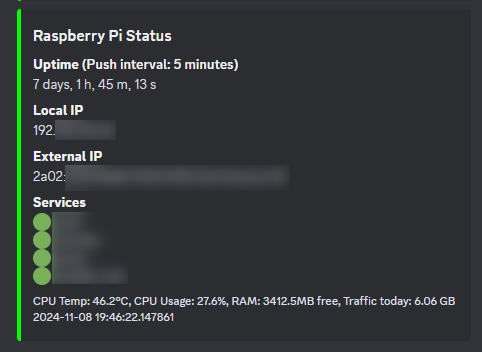

# Raspberry Pi Service and Hardware Monitoring using Discord Webhooks

This Python script is monitoring the status of services (which are running under systemd) and hardware statistics: IP addresses and system health data (CPU temperature and usage, free RAM, used internet traffic) from a Raspberry Pi. 
The results will be sent automatically to a Discord Webhook in a specified interval.



**This was tested with Python3.9 on a Raspberry Pi 4 with a headless Raspbian GNU/Linux 10 (buster) as OS.**

## Installation

1. Clone the Repository:

```bash
git clone https://github.com/mkoebsch/rpi-service-hardware-monitoring.git
cd rpi-service-hardware-monitoring
```

2. Install the dependencies, e. g.:

```bash
pip install -r requirements.txt
```

3. Configuration:

Adjust the values in monitoring.py of TIMER, WEBHOOK_URL and SERVICES in line 11-13 to your needs.

4. Prepare for autorun via systemd, e.g.: (can be also used for other python scripts to run as service)

```bash
sudo nano /lib/systemd/system/monitoring.service
```

Add e. g. the following text:

```bash
[Unit]
Description=Monitoring Service
After=multi-user.target

[Service]
Type=idle
ExecStart=/usr/bin/python /home/pi/monitoring.py
WorkingDirectory=/home/pi

[Install]
WantedBy=multi-user.target
```

Save and exit via CTRL-X, then Y, then ENTER

Give the file the right permissions:

```bash
sudo chmod 644 /lib/systemd/system/monitoring.service
```

Enable the service:

```bash
sudo systemctl daemon-reload
sudo systemctl enable monitoring.service
```

Do a reboot:

```bash
sudo reboot
```

Check the status via:

```bash
sudo systemctl status monitoring.service
```